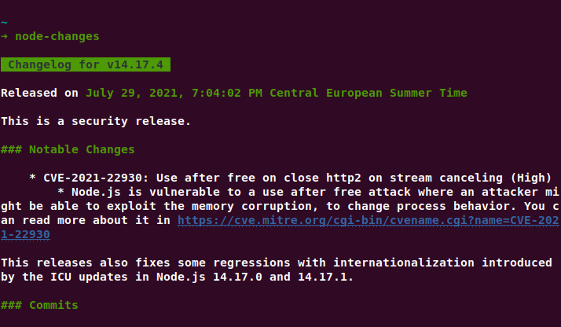

# node-changes - (Node release)

Get the release changelog right from your terminal!

Whenever Node releases a new version of the framework I want to read the changelog, and then I thought: "Why not make changelogs super-nerdy so that I can read the changelog right from my terminal?". And then it happened. I decided to read the GitHub v3 RESTful API and created a CLI tool that lets you read the changelog for your local Node version or for a specific Node version.

## Install
```bash
npm i -g node-changes
```

## Usage
```
Usage: node-changes [options]

Options:
  -t, --tag [ver]  Get changelog for the particular release
```

Or just run 
```
$ node-changes
``` 
to get the changelog for the version on your machine.

## Example


